# bedrock-emotes
A collection of Bedrock Edition emote UUIDs found through gophertunnel that has 36 of the 47 emotes in Minecraft.
Feel free to PR more emotes that aren't already on the list. The goal is to have all 47 identified.

# How do you get these emote IDs?
Emotes are sent by the client using the Emote packet and are broadcasted to other players with the same UUID. These UUIDs are mapped to emote animations client side. However, we can steal these emote IDs by using a gophertunnel client. Once we steal these emote IDs, we upload them to this repository using the bedrock-emotes account and mark them as unidentified, after which users of bedrock-emotes can identify these emotes with a proper image and name.

bedrock-emotes gets the emotes from all featured servers. If the bedrock-emote client gets disconnected from a featured server, it reconnects. The client also automatically moves slightly to avoid anti AFK measures.

# What's the point of grabbing emote IDs?
Emote IDs can be useful for developers trying to incorporate expression into things like NPCs, storytelling, and more. A public collection of all known emotes can be very helpful to many developers.

# Identified Emotes
Below are all identified emotes. These are emotes tested from the unidentified emote
list which are labeled with a name and image.

|               Name               |                 UUID                   |                     Image                  |
|:--------------------------------:|:--------------------------------------:|:------------------------------------------:|
|               Wave               |  4c8ae710-df2e-47cd-814d-cc7bf21a3d67  |            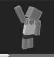          |
|            Simple Clap           |  9a469a61-c83b-4ba9-b507-bdbe64430582  |        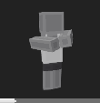       |
|            Over There!           |  ce5c0300-7f03-455d-aaf1-352e4927b54d  |         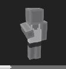       |
|            The Pickaxe           |  d7519b5a-45ec-4d27-997c-89d402c6b57f  |        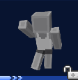       |
|          Diamonds To You!        |  86b34976-8f41-475b-a386-385080dc6e83  |       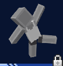    |
|            The Hammer            |  7cec98d8-55cc-44fe-b0ae-2672b0b2bd37  |         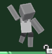       |
|            Faceplant             |  6d9f24c0-6246-4c92-8169-4648d1981cbb  |         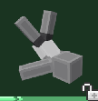        |
|           The Woodpunch          |  42fde774-37d4-4422-b374-89ff13a6535a  |         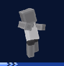        |
|            Abduction?            |  18891e6c-bb3d-47f6-bc15-265605d86525  |         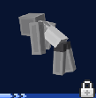        |
|            Fake Death            |  efc2f0f5-af00-4d9e-a4b1-78f18d63be79  |                |
|         Underwater Dancing       |  05af18ca-920f-4232-83cb-133b2d913dd6  |    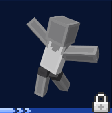    |
|            Hand Stand            |  5dd129f9-cfc3-4fc1-b464-c66a03061545  |        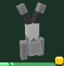        |
|           Shy Giggling           |  f1e18201-729d-472d-9e4f-5cdd7f6bba0c  |        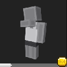      |
|        Meditating Like Luke      |  85957448-e7bb-4bb4-9182-510b4428e52c  |   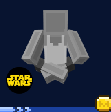   |
|            Breakdance            |  1dbaa006-0ec6-42c3-9440-a3bfa0c6fdbe  |        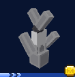        |
|             Offering             |  21e0054a-5bf4-468d-bfc4-fc4b49bd44ac  |                  |
|            The Elytra            |  7393aa53-9145-4e66-b23b-ec86def6c6f2  |        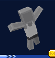        |
|       Giving R2-D2 A Message     |  e1090020-cbe0-4b64-9c41-a3b9619da029  |  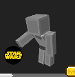  |
|            Ghast Dance           |  5a5b2c0c-a924-4e13-a99b-4c12e3f02e1e  |        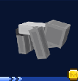       |
|           Playing Zombie         |  5d644007-3cdf-4246-b4ca-cfd7a4318a1c  |      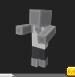      |
|             Sad Sigh             |  98a68056-e025-4c0f-a959-d6e330ccb5f5  |         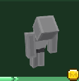         |
|            Surrendering          |  daeaaa6f-db91-4461-8617-400c5d1b8646  |      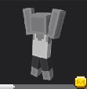        |
|               Bow                |  ddfa6f0e-88ca-46de-b189-2bd5b18e96a0  |          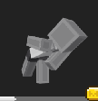             |
|              Shrug               |  4ff73ed2-3c2f-4d74-9055-5fa24e59dc7a  |         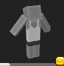            |
|           Disappointed           |  a98ea25e-4e6a-477f-8fc2-9e8a18ab7004  |      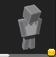        |
|             Facepalm             |  402efb2d-6607-47f2-b8e5-bc422bcd8304  |        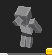          |
|            Rebooting             |  a602063f-1ded-4959-b978-b5ae7f353536  |       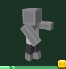          |
|          Cowpoke Dancin'         |  f99ccd35-ebda-4122-b458-ff8c9f9a432f  |    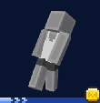        |
|            Golf Clap             |  434489fd-ed42-4814-961a-df14161d67e0  |       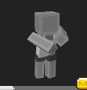          |
|           Foot Stomp!            |  13334afa-bd66-4285-b3d9-d974046db479  |      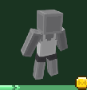          |
|             Bored                |  7a314ecf-f94c-42c0-945f-76903c923808  |        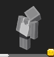             |
|           Big Chuckles           |  819f2f36-2a16-440c-8e46-94c6b003a2e0  |      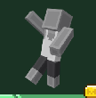        |
|            Ahh Choo!             |  f9345ebb-4ba3-40e6-ad9b-6bfb10c92890  |        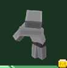          |
|        Dancing Like Toothless    |  a12252fa-4ec8-42e0-a7d0-d44fbc90d753  |  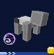  |
|          Victory Cheer           |  d0c60245-538e-4ea2-bdd4-33477db5aa89  |      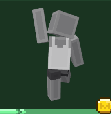       |
|        Acting Like A Dragon      |  c2a47805-c792-4882-a56d-17c80b6c57a8  |  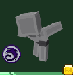    |

# Unidentified Emotes
These are a list of emotes scraped by the bedrock-emotes gophertunnel bot.
These have not been manually checked and have no assigned name or image.

|                UUID                |
|:----------------------------------:|
